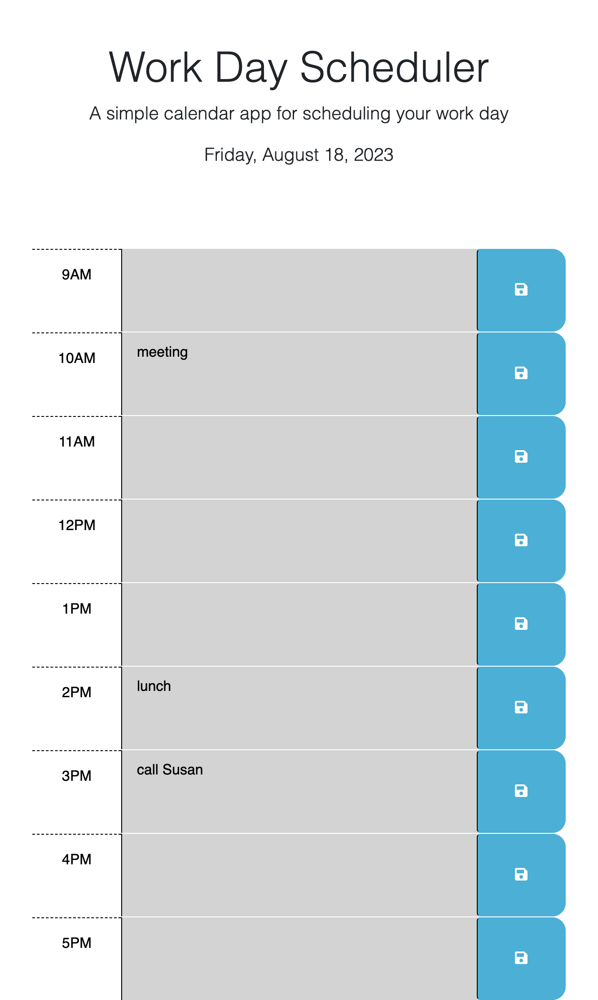

# Work-Day-Scheduler

## Description

The Work Day Scheduler is a web page designed to help you manage your work day efficiently. It provides a user-friendly interface to schedule and track events during typical work hours (9 AM to 5 PM), displaying the current date and color-coding time blocks for easy hour tracking.

## Features

Current Date Display: The web page prominently displays the current date at the top, making it easy for users to quickly identify the present day.

Hourly Event Scheduling: The scheduler covers typical work hours from 9 AM to 5 PM, allowing you to enter and save events for each hour of the workday.

Color-Coded Hour Tracking: The time blocks are color-coded to indicate whether they are in the past, present, or future. This visual distinction helps you easily identify the current hour and manage your schedule effectively.

Event Storage: Events entered into the scheduler can be saved and stored using local storage. This means that even if you refresh the page or close your browser, your scheduled events will be retained for your convenience.

## Usage

Open the Work Day Scheduler web page in your preferred web browser.
Upon loading the page, the current date will be displayed at the top of the page.
You will see hourly time blocks from 9 AM to 5 PM. Each time block includes:
A text area where you can enter and edit your event for that hour.
A "Save" button to save your event.
As the day progresses, the time blocks will be color-coded as follows:
Past hours - Gray.
Present hour - Red.
Future hour - Green.
To schedule an event, click inside the corresponding text area for the desired hour, enter your event details, and click the "Save" button.
Your event will be saved and will persist even if you refresh the page or close the browser.

## Screenshot and link

The page can be accessed [here] (https://alexandrazykova.github.io/Work-Day-Scheduler/)

## Technologies Used

HTML.
CSS and Bootstrap for styling.
JavaScript and jQuery for DOM manipulation.
Day.js library for dates and times display.